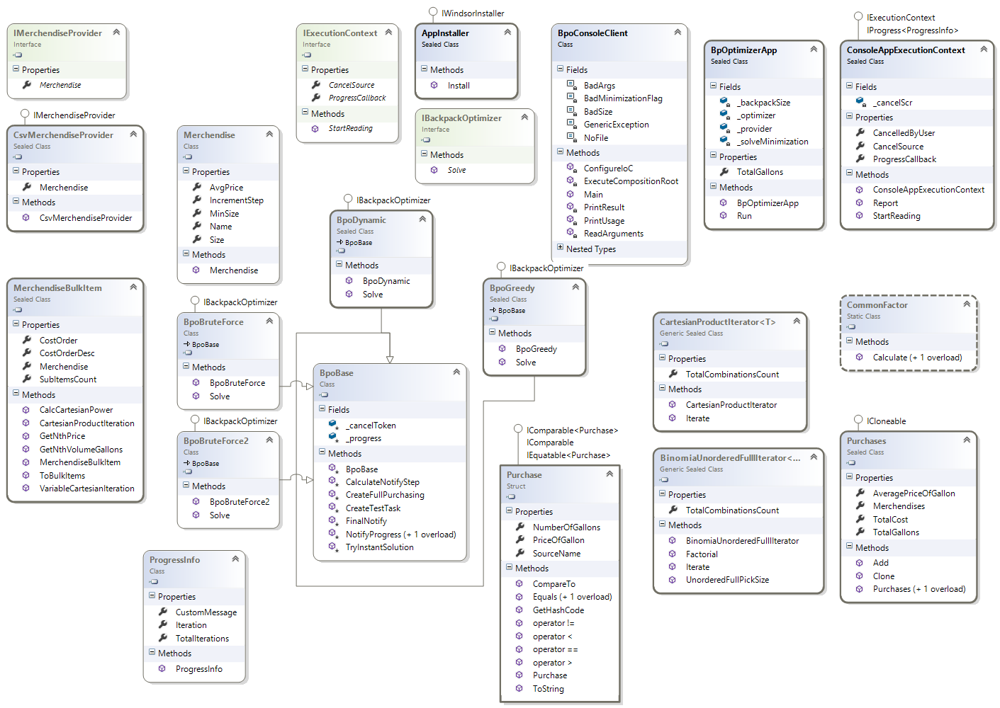

## Условие
Уилл Тернер решил устроить пир как в старые добрые времена и попросил своего друга, капитана Джека Воробья, организовать это мероприятие. Джек решил, что для того чтобы пирушка удалась, ему необходимо купить N галлонов ямайского рома Appleton. Ром можно добыть в ряде мест:

* В Порт-Ройале есть три лавки, в которых торгуют ромом. В лавке Мэллроя есть 50 бутылок (в бутылке один галлон) по цене 50 пиастров за штуку, в лавке Сяо Фэня есть 60 бутылок по цене 52 пиастра, и в винном погребе Черной Бороды есть 200 по цене 55 пиастров.

* Сундук со ста бутылками отличного рома имеется у Дэйви Джонса на палубе Летучего голландца. Проблема в том, что Дэйви не торгует ромом, и чтобы раздобыть этот сундук Джеку необходимо щедро заплатить дюжине отважных пиратов, которые помогут захватить сундук силой. Суммарные расходы на захват сундука составляют 5100 пиастров.

* Похожая ситуация с Гектором Барбоссой. У Гектора есть целых три сундука по сто бутылок, каждый из которых стоит 5050 пиастров, и он даже готов их продать. Но Гектор в данный момент уплыл на Странные берега, и ради продажи одного сундука возвращаться не станет. Но он готов вернуться, если купить у него хотя бы два сундука.

* Также небольшое торговое судно с ромом некогда было захвачено Кракеном. В нем есть двести бутылок хорошо сохранившегося рома, но чтобы отбить судно у Кракена потребуется небольшой флот. Нанять необходимое число кораблей можно за 10800 пиастров.

Лишних пиастров у Джека никогда не бывает, поэтому он хочет минимизировать свои расходы. Напишите Java программу, которая реализует интерфейс JackSparrowHelper.

**P.S.** Программа должна быть понятно написана

**P.P.S.** Программа будет протестирована с использованием не только приложенного, но и другого csv файла, имеющего тот же формат.

```Java
package pirates;

public class Purchase {
    String sourceName; // название источника в файле sources.csv
    Integer numberOfGallons; // число галлонов, купленное у этого источника
    Double priceOfGallon; // цена галлона у этого источника
}
```

```Java
package pirates;

import java.util.TreeSet;

public class Purchases {
    Integer numberOfGallons; // совокупное число галлонов (из условия)
    TreeSet<Purchase> purchases; // набор покупок в разных источниках
    Double averagePriceOfGallon; // средняя цена галлона по всем источникам
}
```

```Java
package pirates;

public interface JackSparrowHelper {
    /**
     * @param path            Полный путь к csv файлу с ценами и количествами (sources.csv), доступными в разных местах
     * @param numberOfGallons совокупное количество галлонов, нужное Джеку
     * @return <tt>Purchases</tt> детальный совет Джеку, где и в каком количестве покупать ром
     */
    Purchases helpJackSparrow(String path, int numberOfGallons);
}
```
**Пример исходных данных (CSV)**
```CSV
Source Name;Size;Average price of gallon;Min size;Step size
Mulroy;50;50.0;1;1
Sao Feng;60;52.0;1;1
Black Beard;200;55.0;1;1
Davy Jones;100;51.0;100;100
Hector Barbossa;300;50.5;200;100
Kraken;200;54.0;200;200
```
**Диаграмма классов**
